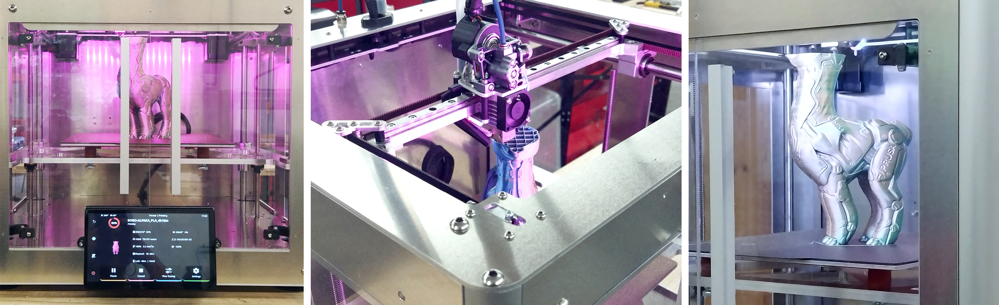

<h1 style=align="center">OLSK Small 3D Printer V2</h1>

<i>Open Source 3D Printer - Small version - Open Lab Starter Kit</i>

 

Introduction
--

OLSK Small 3D Printer v2 is an open-source desktop 3D printer with a printing volume of 240 x 240 x 240 mm. Its rigid frame is fully composed of aluminum interlocked plates. The coreXY motion system allows a good quality fast printing of max motion at 1200mm/s at 20k mm/s2 acceleration (it prints this Prusa 3D model 2x faster than its original Prusa 3D printer). The bed has an automatic mesh leveling and Z tilt alignment and the printing surface with a non-sticking layer is removable. It also features a user-friendly interface with Klipper-based firmware, a touch screen, and a filament runout sensor for a smooth printing experience. The housing is enclosed to keep a higher temperature. 

The Assembly Workbook
--

All OLSK machines are open source and have the BOM and necessary files available in this repository for replication. The assembly of parts is also documented in a workbook where each step contains a list of parts, tools and instruction remarks, following a logic order to provide a smooth assembly.

Specifications V2
--

Dimensions
- Physical Dimensions: 460 x 540 x 610 mm
- Printing Volume: 220 x 240 x 240 mm
  
Speed
- Max Speed: 1200 mm/s
- Standard Jog Speed: 800 mm/s
- Standard Printing speed: 300 mm/s
- Max Acceleration: 20000 mm/s²
  
Extruder
- Max temperature 295°C
- Ultra light setup
- Direct drive , dual gear
- Bimetallic Heatbreak (all metal)
- High flow nozzle - 0.4mm standard (other sizes available)
- Fast heating: 50W heating cartridge
- Capricorn ultra low friction inverse bowden PTFE tube
- Integrated accelerometer (for input shapping)
  
Bed - Printing Surface
- Removable magnetic flex plate
- Textured PEI coated
- Mesh bed leveling (deploying probe)
- Z tilt / bed traming - Independent dual Z stepper motors
- Fast heating - 24V,300W silicon heating pad Pad

Features
- High performance Stepper motor drivers - TMC5160 pro (48v)
- High performance Stepper motors - LDO 42STH48-2804AH
- High quality Power supply - Meanwell 48v 600W
- High definition Touchscreen interface - 7 inch
- Monitoring camera - 1920×1080@30fps
- High flow remote part cooling fan
- Filament sensor (auto pause)
- Neopixel customizable RGB LEDs
- WIFI connectivity

Software
- Firmware: Klipper
- Control and monitoring Interface: Mainsail
- Slicer: Orca Slicer (Compatible with most slicers, orca slicer profiles are provided)

Files
--

- **[BOM](BOM)**
- **[CAD](CAD)**
- **[Firmware](Firmware)**
- **[Assembly Workbook](OLSK_Small_3D_Printer_V2_Workbook.pdf)**
- **[Wiring Schematic](OLSK_Small_3D_Printer_V2_Wiring_Schematic.pdf)**

Author
--

OLSK Large 3D Printer has been designed and built by **[InMachines Ingrassia GmbH](https://www.inmachines.net/)**.

 

Machine design:
- **[Wilhelm Schütze](http://fabacademy.org/archives/2015/sa/students/schutze.wilhelm/index.html)**

The machine is part of the **[Open Lab Starter Kit (OLSK)](https://www.inmachines.net/open-lab-starter-kit)** group of open source digital fabrication machines.

OLSK is developed by **[InMachines Ingrassia GmbH](https://www.inmachines.net/)** for the **[Dtec project](https://dtecbw.de/home/forschung/hsu/projekt-fabcity)** at **[Fab City Hamburg](https://www.fabcity.hamburg/en/)**.

OLSK Partners:
  

Contact
--

- daniele@inmachines.net
- [https://www.inmachines.net/](https://www.inmachines.net/)

License
--

Hardware design, CAD and PCB files, BOM, settings and other technical or design files are released under the following license:

- CERN Open Hardware Licence Version 2 Weakly Reciprocal - **[CERN-OHL-W](LICENSE_CERN_OHL_W_V2.txt)**

Assembly manual, pictures, videos, presentations, description text and other type of media are released under the following license:

- Creative-Commons-Attribution-ShareAlike 4.0 International - **[CC BY-SA 4.0](LICENSE_CC_BY_SA_4.0.txt)**

Previous Version
--

**[OLSK Small 3D Printer V1](OLSK_Small_3D_Printer_V1)**
 

