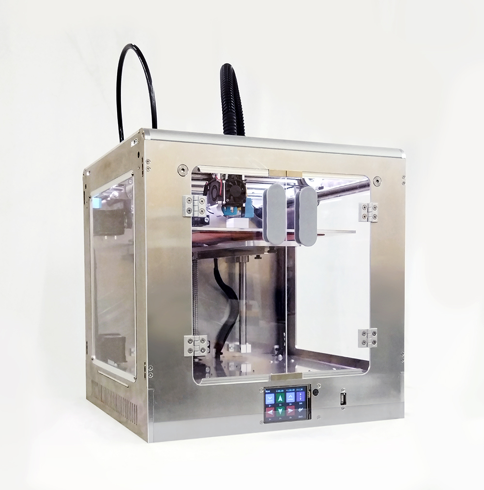

<h1 style=align="center">OLSK Small 3D Printer V1</h1>

<i>Open Source 3D Printer - Small version - Open Lab Starter Kit</i>

 

Introduction
--

OLSK Small 3D Printer V1 is an open source desktop 3D printer with printing volume of 200 x 200 x 200 mm. Its rigid frame, fully composed of aluminum intelocked plates, and its robust linear rail system makes the machine very stable for printing, in addition to the ballscrew Z-axis ball screw which contributes to its precision. The adjustable and auto-leveling bed is heated and with good adhesion, covered with an non-sticking layer to facilitate the removal of the prints. The housing is enclosed to keep a higher temperature. It also features a touch screen, light and sound indicators and silent motion using trinamic drivers.

The Assembly Workbook
--

All OLSK machines are open source and have the BOM and necessary files available in this repository for replication. The assembly of parts is also documented in a workbook where each step contains a list of parts, tools and instruction remarks, following a logic order to provide a smooth assembly.

Specifications V1
--

- printing volume: 200 x 200 x 200 mm
- frame and housing: CNC milled aluminum interlocked plates
- bed: aluminum with non-sticking layer
- motion: GT2 10mm belt, 12mm ball screw
- guides: 16mm linear shaft, 12mm linear rails
- motors: stepper motor NEMA 17
- drivers: trinamic
- adjustable and heated printing bed
- auto-leveling bed with inductive probe
- robust frame
- homing with inductive sensors
- touch screen
- light and sound indicators
- closed housing

Files
--

- **[Assembly Workbook](OLSK_Small_3D_Printer_V1_Workbook.pdf)**
- **[Wiring Schematic](OLSK_Small_3D_Printer_V1_Wiring_Schematic.pdf)**

Author
--

OLSK Large 3D Printer has been designed and built by **[InMachines Ingrassia GmbH](https://www.inmachines.net/)**.

 

Machine design:
- **[Wilhelm Schütze](http://fabacademy.org/archives/2015/sa/students/schutze.wilhelm/index.html)**

The machine is part of the **[Open Lab Starter Kit (OLSK)](https://www.inmachines.net/open-lab-starter-kit)** group of open source digital fabrication machines.

OLSK is developed by **[InMachines Ingrassia GmbH](https://www.inmachines.net/)** for the **[Dtec project](https://dtecbw.de/home/forschung/hsu/projekt-fabcity)** at **[Fab City Hamburg](https://www.fabcity.hamburg/en/)**.

OLSK Partners:
  

Contact
--

- daniele@inmachines.net
- [https://www.inmachines.net/](https://www.inmachines.net/)

License
--

Hardware design, CAD and PCB files, BOM, settings and other technical or design files are released under the following license:

- CERN Open Hardware Licence Version 2 Weakly Reciprocal - **[CERN-OHL-W](LICENSE_CERN_OHL_W_V2.txt)**

Assembly manual, pictures, videos, presentations, description text and other type of media are released under the following license:

- Creative-Commons-Attribution-ShareAlike 4.0 International - **[CC BY-SA 4.0](LICENSE_CC_BY_SA_4.0.txt)**
