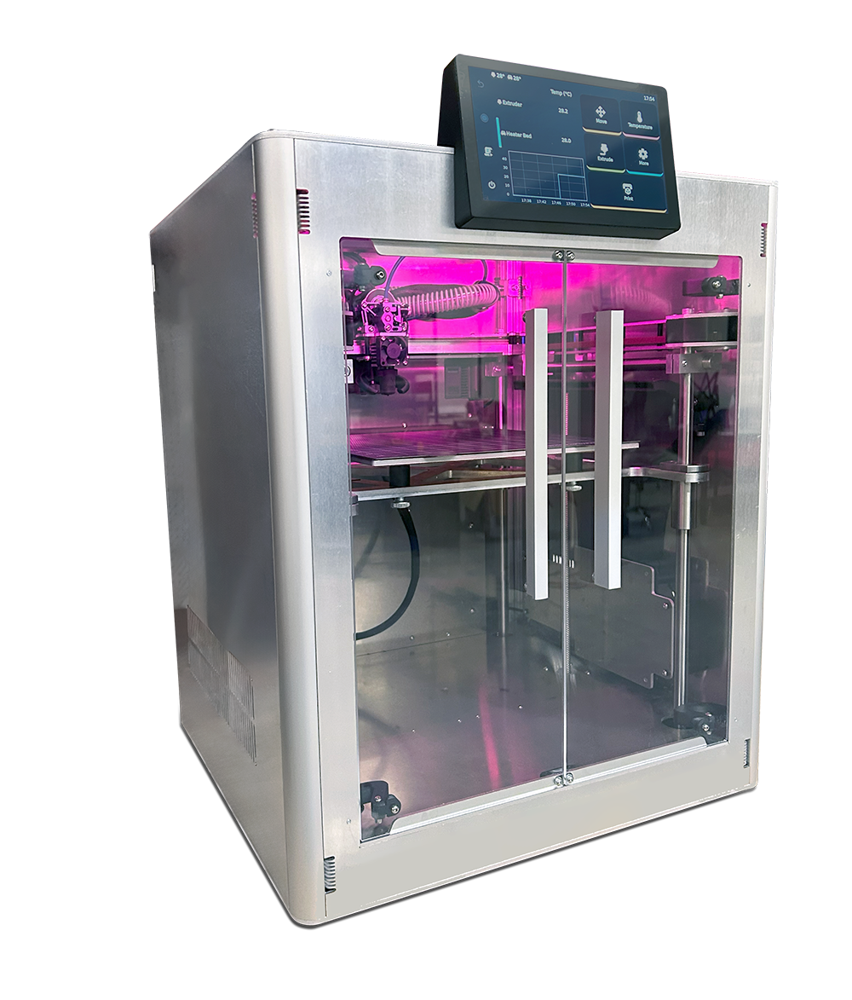
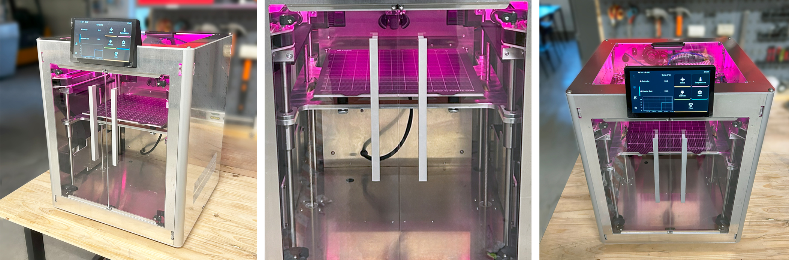
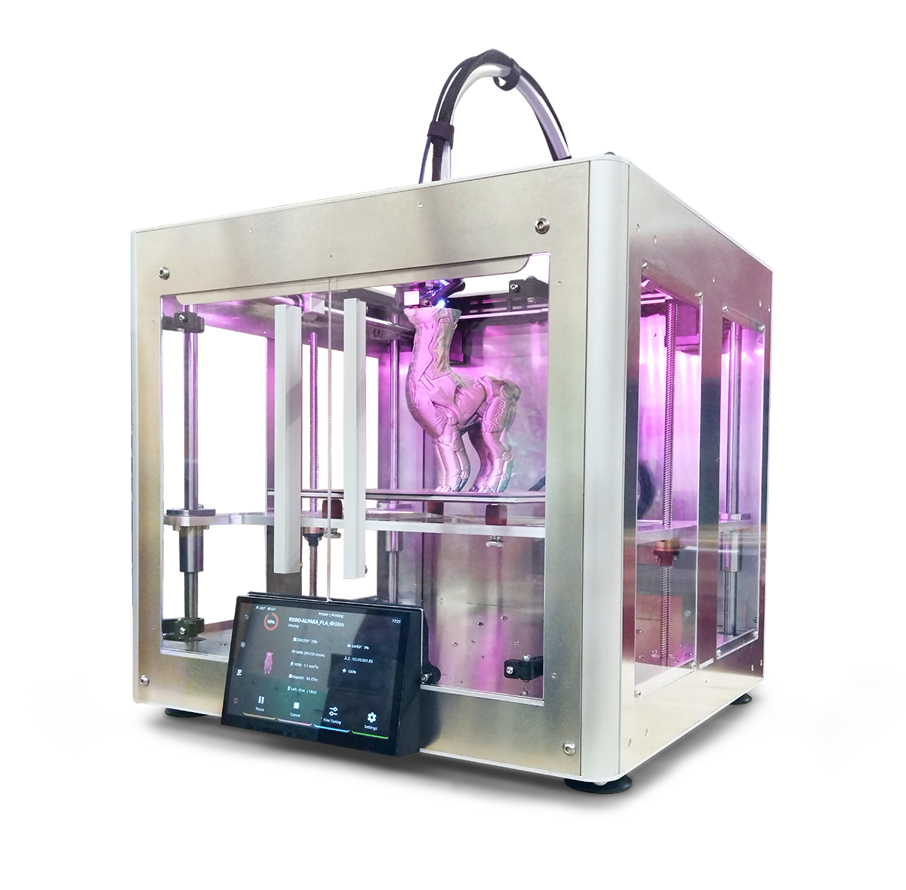

<h1 style=align="center">OLSK Small 3D Printer V3</h1>

<i>Open Source 3D Printer - Small version - Open Lab Starter Kit</i>

 

Introduction
--

OLSK Small 3D Printer v3 is an open-source desktop 3D printer with active cooled Core XY motion system and independent Z motors. It auto-calibrates before each print under 5 min with the Eddy Current Surface Scanner. It also features a built-in accelerometer, an enhanced cooling system with auxiliary part cooling fans, high flow nozzle and filament sensor. Its housing is fully enclosed for thermal stability. For maintenance, the magnetic beds are removable and the electronic compartment is easily accessible. 

The Assembly Manual
--

All OLSK machines are open source and have an assembly manual, the BOM and necessary files available in this repository for replication. The assembly manual is an interactive 3D guide though each step and contains a list of parts, tools and instruction remarks, which follows a logical order to provide a smooth assembly.

- **[Assembly Manual](https://open-lab-starter-kit.github.io/OLSK-Small-3D-Printer/)**

Specifications V3
--

- Max travel speed: 1000mm/s @ 25k mm²/s
- Max printing speed: 300mm/s
- Printing volume: 235*235*235mm
- V6 standard nozzle compatibility
- 7 inch touchscreen
- Dual PSU 24v 350w + 55v 350w
- Klipper firmware based (customized)
- Motion system: core XY

Files
--

- **[CAD](cad)**
- **[Firmware](firmware)**
- **[Settings](settings)**
- **[BOM](OLSK_Small_3D_Printer_V3-BOM.xlsx)**
- **[Wiring Schematic](OLSK_Small_3D_Printer_V3_WiringSchematic.pdf)**

Author
--

OLSK Small 3D Printer has been designed and built by **[InMachines Ingrassia GmbH](https://www.inmachines.net/)**.

 

Machine design:
- **[Wilhelm Schütze](http://fabacademy.org/archives/2015/sa/students/schutze.wilhelm/index.html)**

The machine is part of the **[Open Lab Starter Kit (OLSK)](https://www.inmachines.net/open-lab-starter-kit)** group of open source digital fabrication machines.

OLSK is developed by **[InMachines Ingrassia GmbH](https://www.inmachines.net/)** for the **[Dtec project](https://dtecbw.de/home/forschung/hsu/projekt-fabcity)** at **[Fab City Hamburg](https://www.fabcity.hamburg/en/)**.

OLSK Partners:
  

Contact
--

- daniele@inmachines.net
- [https://www.inmachines.net/](https://www.inmachines.net/)

License
--

Hardware design, CAD and PCB files, BOM, settings and other technical or design files are released under the following license:

- CERN Open Hardware Licence Version 2 Weakly Reciprocal - **[CERN-OHL-W](LICENSE_CERN_OHL_W_V2.txt)**

Assembly manual, pictures, videos, presentations, description text and other type of media are released under the following license:

- Creative-Commons-Attribution-ShareAlike 4.0 International - **[CC BY-SA 4.0](LICENSE_CC_BY_SA_4.0.txt)**

Previous Version
--

The previous versions of OLSK machines will always be available.

**[OLSK Small 3D Printer V2](OLSK_Small_3D_Printer_V2)**
 

**[OLSK Small 3D Printer V1](OLSK_Small_3D_Printer_V1)**
 

